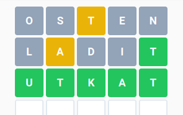

# hadej-rychle
Helper tool for the https://hadejslova.cz/  game. 

In Czech.

## Proč

Tato utilita pomáhá rychlejšímu vyřešení hádanky, jež se každý den zjevuje na adrese 
https://hadejslova.cz/

Místo obvyklých 10-15 minut nutných každý den k intenzivnímu přemýšlení nad rébusem vám díky
tomuto skriptu stačí minut třeba 5, takže zbylý čas můžete věnovat něčemu užitečnějšímu.

## Předpoklady 

* Ruby
* iconv, awk, 7z (pouze pro výrobu slovníku)

## Instalace

Součástí tohoto repository _není_ slovník pětipísmenných českých slov. Je třeba jej vyrobit, 
například ze slovníku, jenž je [k dispozici zde](https://gpsfreemaps.net/navody/security/komplexni-cesky-a-slovensky-wordlist-ke-stazeni).

Postup výroby:

```
wget https://gpsfreemaps.net/files/security/wordlist/CZ.7z
7z x CZ.7z
iconv --from=WINDOWS-1250 --to=UTF8 < CZ.txt > CZ-UTF8.txt
awk -F, 'length($1)==6' < CZ-UTF8.txt > CZ-UTF8-words5.txt
```

Ať už získáte slovník jakkoliv, na konci procesu musí existovat soubor s pětipísmennými 
českými slovy (co slovo, to řádek, kódování UTF-8) pojmenovaný `CZ-UTF8-words5.txt`.

Pozn. Ačkoliv výše zmíněný slovník obsahuje i mnoho cizích nebo velmi nepravděpodobných slov,
některá slova vám neporadí. Např. 1.3. bylo hádaným slovem `DABÉR`, které ve `wordlist/CZ.7z`
nenajdete.

## Použití

Utilita `hadej.rb` filtruje slova vyhovující maskám, které hádanka během hraní postupně poskytuje.
Každá maska je použita jako jeden argument na příkazové řádce. Pětipísmenná maska je zadaná jako
pět dvojic znaků {typ,znak}.

Typy znaků:

* `!` písmeno na správné místě (zelená)
* `+` správné písmeno na nesprávném místě (žlutá)
* `.` nesprávné písmeno (šedá)

Pozn.: Zadávaný znak může být velký nebo malý.

Volitelné argumenty (options):

* `--unique`  .. písmena se neopakují (vhodné v prvních krocích)
* `--added <chars>`  .. vhodné v situaci, kdy se písmeno ve slově zobrazuje zeleně, ale na 
    klávesnici žlutě. Jde o případ, kdy se [písmeno ve slově opakuje](https://hadejslova.cz/faq) 
    a jedna z jeho pozic byla uhádnuta.

### Příklad

Hádanka ze dne 26.2. obsahovala slovo "UTKAT". Postup byl následující:



1. První slovo by mělo obsahovat častá písmena bez opakování. Vhodné je například "OSTEN".
    Jako zpětnou vazbu získáme informaci, že ve slově je písmeno `T`, nejméně jednou, a zároveň
    víme, že se nenachází uprostřed. Zadáme tedy:
    
```
./hadej.rb '.O.S+T.E.N' --unique |less
...
DRKAT
LADIT
RADIT
TILDA
...
```

2. Vybereme si další slovo "LADIT". Hra reaguje informací o tom, se nám podařilo správně 
    umístit `T` a že přítomné je i písmeno `A` na jiném než druhém místě. Navíc se dozvídáme
    i to, že se ve slově někde nachází i další `T`, protože na klávesnici svítí žlutě, 
    nikoliv zeleně. Přidáme další masku, odstraníme `--unique` a vyžádáme si další `T`:
    
```
./hadej.rb '.O.S+T.E.N' '.l+a.d.i!t' --added=T |less
...
TRVAT
TRAKT
TRKAT
PRATT
TUKAT
UTKAT
UTRAT
TÁPAT
TÁZAT
...
```

3. S každou další maskou se množství vyhovujících slov snižuje. Přesto jich v této fázi 
dostáváme 20. Vybereme si "UTKAT" a máme štěstí. Čas: 4min 44s.

## ČKD

1. Proč Ruby?

Ruby je nedoceněný ergonomický jazyk. Mám ho rád a mrzí mě, že poslední dobou ztrácí na popularitě.

2. Nešlo by to napsat jednodušeji?

Určitě šlo a vím jak -- např. s větší pomocí regulárních výrazů. Pokud se mi bude chtít, zjednoduším to.

3. Proč příkazová řádka?

Nechtělo se mi z toho dělat větší projekt.

4. Nebylo by lepší si raději lámat hlavu o pár minut déle?

Asi bylo. Ta hra je dobrá, jen já jsem líný.


